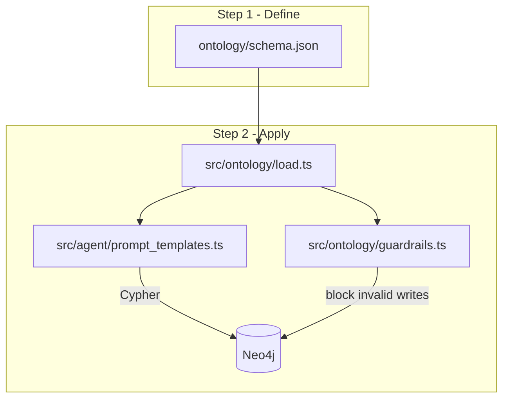
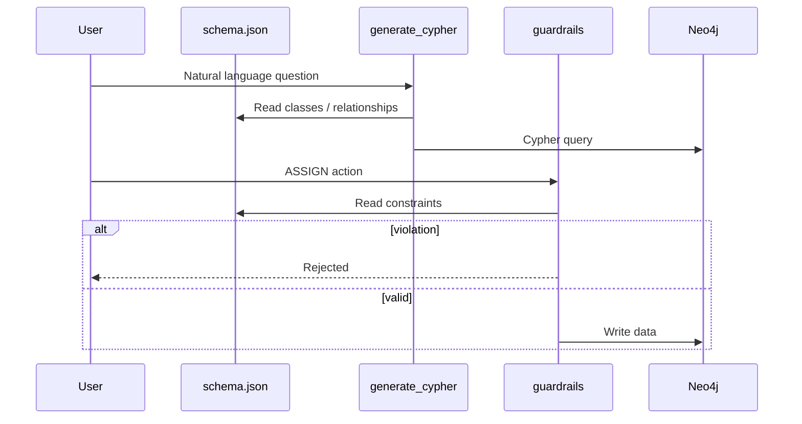

# Semantic Graph Agent — Ontology-first + Neo4j

This repo implements an **ontology-first** workflow: define the worldview in `ontology/schema.json`, then **apply** it to Neo4j, OpenAI-powered Cypher generation, and business guardrails.

The ontology is the **Single Source of Truth (SSOT)**. Change the rules in one file and both the AI system prompt and validation logic stay aligned.

| Document | Contents |
|----------|----------|
| **[docs/ARCHITECTURE.md](docs/ARCHITECTURE.md)** | Layers, flows, diagrams, extension points |
| **[docs/GUIDE.md](docs/GUIDE.md)** | Setup, Neo4j, OpenAI, Cursor, troubleshooting |

---

## Why ontology first?

### Without an ontology

In vibe coding / AI-assisted projects, logic often spreads across:

- AI prompts guessing Neo4j labels and relationships
- TypeScript hard-coded business rules
- Hand-written Cypher migrations that drift from prompts

Changing the domain means editing many places → inconsistent graphs and invented relationships.

### The fix

| Layer | Role | Main file |
|-------|------|-----------|
| **Rules (TBox)** | What exists, how things connect, what is forbidden | `ontology/schema.json` |
| **Data (ABox)** | Instances in the graph | `database/migrations/001_init.cypher` |
| **Apply** | Load rules → AI + validate + Neo4j | `src/*` |



**Vibe coding rule:** change business logic only in `ontology/schema.json`, then restart the app. Do not scatter rules across TypeScript files.

---

## Repository layout

```
ontology/
  schema.json              # Step 1: canonical ontology (SSOT)
  schema.template.json     # Empty template for new projects
  neo4j.mapping.json       # Ontology → Neo4j mapping
  instance.schema.json     # (Optional) JSON-LD instance validation
  template/                # (Optional) vibe-code / JSON-LD extensions
  profiles/
  project/apply.template.json

src/
  ontology/load.ts         # Load schema.json
  ontology/guardrails.ts   # Enforce constraints
  agent/prompt_templates.ts
  agent/generate_cypher.ts # OpenAI / mock → Cypher
  neo4j/client.ts
  index.ts                 # End-to-end demo

database/
  docker-compose.yml
  migrations/001_init.cypher

schema.jsonld              # Optional JSON-LD bundle entry
```

---

## Step 1: Define the ontology

Canonical file: **`ontology/schema.json`**.

### Three required sections

**1. `classes`** — Entity types (become Neo4j labels)

```json
"Employee": {
  "description": "Company staff member",
  "properties": {
    "empId": "Unique identifier (e.g. EMP001)",
    "name": "Display name",
    "role": "Job role (e.g. Developer, Designer)"
  }
}
```

**2. `relationships`** — Allowed edges (become Neo4j relationship types)

```json
{
  "source": "Employee",
  "predicate": "HAS_SKILL",
  "target": "Skill",
  "description": "Employee possesses a skill"
}
```

**3. `constraints`** — Machine-readable business rules (used by guardrails)

```json
{
  "id": "hard-project-requires-skill",
  "action": "ASSIGN_TO_PROJECT",
  "when": { "projectDifficulty": { "equals": "Hard" } },
  "rule": {
    "type": "skillOverlap",
    "employeeSkillsField": "employeeSkills",
    "projectSkillsField": "projectSkills"
  },
  "rejectMessage": "..."
}
```

### Sample domain in this repo (project management)

| Class | Description |
|-------|-------------|
| `Employee` | Staff member |
| `Project` | Company project |
| `Skill` | Technology or skill |

| Relationship | Meaning |
|--------------|---------|
| `HAS_SKILL` | Employee → Skill |
| `ASSIGNED_TO` | Employee → Project |
| `REQUIRES_SKILL` | Project → Skill |

| Constraint | Meaning |
|------------|---------|
| `hard-project-requires-skill` | Assigning to a `Hard` project requires at least one overlapping required skill |

### Setup for a new project

1. Copy `ontology/schema.template.json` → `ontology/schema.json`
2. Fill in `classes`, `relationships`, and `constraints` for your domain
3. Update `ontology/neo4j.mapping.json` (labels, relationship types, unique keys)
4. Write or edit `database/migrations/001_init.cypher` using only declared labels and relationships
5. Run `npm run dev` to verify Cypher generation and guardrails

---

## Step 2: Apply the ontology

### Runtime flow (`src/index.ts`)

1. `loadOntology()` — reads `ontology/schema.json`
2. `generateCypherQuery()` — OpenAI (or mock) uses the ontology as a map → Cypher
3. `validateAction()` — checks actions against `constraints`
4. (Optional) `runReadQuery()` — runs Cypher on Neo4j when `NEO4J_EXECUTE=true`

### AI and Cypher (OpenAI)

`src/agent/prompt_templates.ts` embeds the full ontology in the system prompt and restricts:

- **Labels** to those in `classes`
- **Relationships** to those in `relationships`
- Response format: JSON `{ "cypher": "..." }`

Example question: *"List all skills for employee EMP001"*

```cypher
MATCH (e:Employee {empId: 'EMP001'})-[:HAS_SKILL]->(s:Skill) RETURN s.name
```

### Guardrails

`src/ontology/guardrails.ts` reads `constraints` from the ontology instead of hard-coding rules in TypeScript.

Before `ASSIGN_TO_PROJECT`, the system validates input (e.g. skill overlap for `Hard` projects). Violations are rejected before writing to Neo4j.

---

## How Neo4j uses the ontology

Neo4j does not read JSON files directly. The ontology is applied through:

### 1. Structural mapping — `ontology/neo4j.mapping.json`

| Ontology | Neo4j |
|----------|--------|
| class `Employee` | label `:Employee` |
| predicate `HAS_SKILL` | `-[:HAS_SKILL]->` |
| property `empId` | node property |
| unique key | `CREATE CONSTRAINT ...` |

### 2. Seed data — `database/migrations/001_init.cypher`

```cypher
MERGE (e1:Employee {empId: 'EMP001', name: 'An Nguyen', role: 'Developer'})
MERGE (e1)-[:HAS_SKILL]->(s1:Skill {skillId: 'SKL-JAVA', name: 'Java'})
```

### 3. Queries via AI

Natural language → OpenAI reads `schema.json` → ontology-valid Cypher → `session.run()`.

### 4. Write protection

The application layer (`guardrails`) enforces constraints. Direct ad-hoc Cypher can still bypass rules unless you add database-level checks.



---

## Quick start

### Requirements

- Node.js 18+
- Docker (optional, for local Neo4j)

### Install

```bash
npm install
cp .env.example .env
```

### Demo (no Neo4j required)

```bash
npm run dev
```

Expected output:

- Cypher generated for an EMP001 skills question
- Guardrail demo rejecting a `Hard` project assignment without matching skills

### Local Neo4j

```bash
cd database && docker compose up -d
```

Open [http://localhost:7474](http://localhost:7474) and run `database/migrations/001_init.cypher`.

In `.env`:

```env
NEO4J_URI=bolt://localhost:7687
NEO4J_USER=neo4j
NEO4J_PASSWORD=strong_password_here
NEO4J_EXECUTE=true
```

```bash
npm run dev
```

### OpenAI (live model)

```env
OPENAI_API_KEY=your_key
OPENAI_MODEL=gpt-4o-mini
```

Without `OPENAI_API_KEY`, the app uses a mock Cypher generator (fine for local dev and tests).

### Build

```bash
npm run build
npm start
```

---

## Environment variables

| Variable | Description | Default |
|----------|-------------|---------|
| `OPENAI_API_KEY` | OpenAI API key | (mock if empty) |
| `OPENAI_MODEL` | OpenAI chat model | `gpt-4o-mini` |
| `NEO4J_URI` | Bolt URI | `bolt://localhost:7687` |
| `NEO4J_USER` | Neo4j username | `neo4j` |
| `NEO4J_PASSWORD` | Neo4j password | `strong_password_here` |
| `NEO4J_EXECUTE` | Run generated Cypher on Neo4j | `false` |

---

## Reuse in another project

See `ontology/project/apply.template.json`:

1. **Step 1:** `ontology/schema.json` (from `schema.template.json`)
2. **Step 2:** copy `src/ontology`, `src/agent`, `src/neo4j`, `package.json`, `database/`

---

## Summary

| Question | Answer |
|----------|--------|
| Why ontology first? | One rule file shared by AI, guardrails, and the graph |
| How to set up ontology? | Edit `classes`, `relationships`, `constraints` in `schema.json` |
| How does Neo4j use it? | Classes → labels, predicates → relationships, constraints → guardrails + migrations |

**Workflow:** write `schema.json` → update `neo4j.mapping.json` → seed Cypher → `npm run dev` → enable Neo4j + `NEO4J_EXECUTE` when ready.
