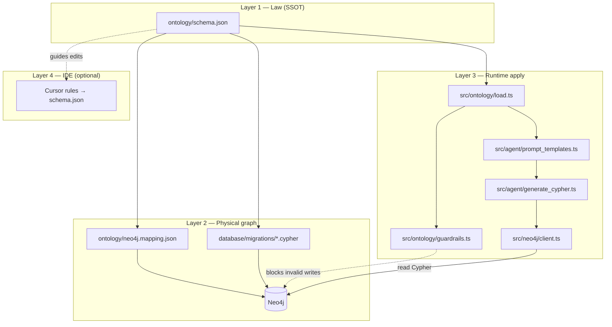
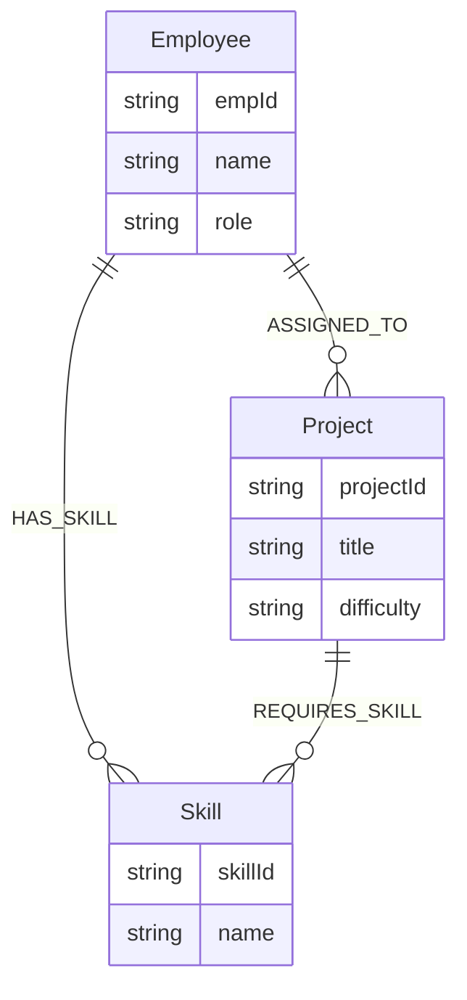
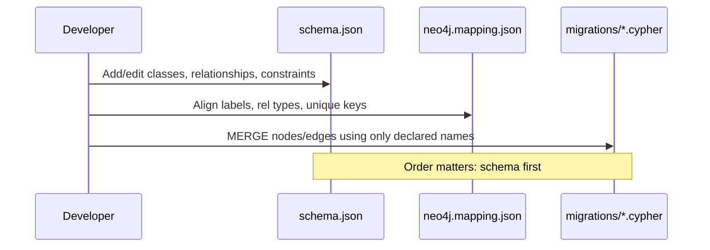
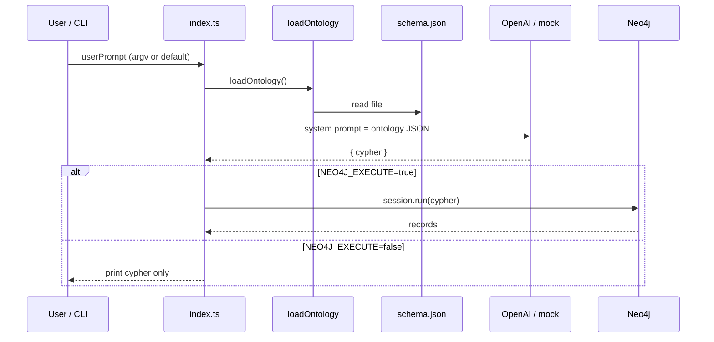
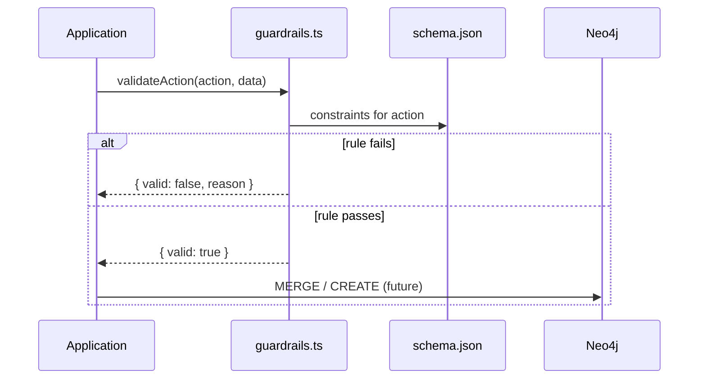
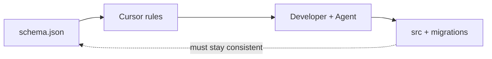

# Architecture & Flow

Ontology-first semantic graph agent: one rule file drives the graph, runtime AI, and (optionally) IDE behavior.

**Related:** [Usage Guide](./GUIDE.md) · [README](../README.md)

---

## Design principles

| Principle | Meaning |
|-----------|---------|
| **SSOT** | `ontology/schema.json` is the only place for domain rules |
| **Define before apply** | Edit ontology → update graph mapping → run apply layer |
| **Same vocabulary everywhere** | Labels/relationships in Neo4j match `classes` / `relationships` in JSON |
| **IDE-agnostic runtime** | Neo4j + OpenAI + guardrails work without Cursor; Cursor is an optional editor layer |

---

## Four layers



| Layer | Responsibility | Failure mode if skipped |
|-------|----------------|-------------------------|
| 1 | Classes, relationships, constraints | Ad-hoc labels and invented edges in Neo4j/AI |
| 2 | Persist and query graph data | No real graph or schema drift |
| 3 | Load rules, generate Cypher, enforce constraints | Ontology is documentation only |
| 4 | Keep vibe-code edits aligned with SSOT | Human/Agent edits bypass rules during coding |

---

## Repository map

```
ontology/
  schema.json                 # Layer 1 — canonical ontology
  schema.template.json        # Empty starter for new projects
  neo4j.mapping.json          # Layer 2 — ontology → Neo4j
  instance.schema.json        # Optional JSON-LD instance validation
  template/ + profiles/       # Optional extended vocab (vibe-code JSON-LD)
  project/apply.template.json # Copy checklist for new repos

database/
  docker-compose.yml          # Local Neo4j
  migrations/001_init.cypher  # Constraints + seed data

src/
  ontology/load.ts            # Parse schema.json
  ontology/guardrails.ts      # Evaluate constraints
  ontology/types.ts
  agent/prompt_templates.ts   # OpenAI system prompt from ontology
  agent/generate_cypher.ts    # OpenAI or mock → { cypher }
  neo4j/client.ts             # Bolt driver + read queries
  index.ts                    # Demo orchestration
```

---

## Data model (sample domain)

From `ontology/schema.json` (Project Management):



**Constraint (business):** `ASSIGN_TO_PROJECT` to a `Hard` project requires skill overlap between employee skills and project required skills (`hard-project-requires-skill`).

---

## Ontology file shape

```json
{
  "classes": { "...": { "description", "properties" } },
  "relationships": [{ "source", "predicate", "target", "description" }],
  "constraints": [{ "id", "action", "when", "rule", "rejectMessage" }]
}
```

| Section | Neo4j | Runtime |
|---------|-------|---------|
| `classes` | Node labels | Allowed labels in AI prompt |
| `relationships` | Relationship types | Allowed predicates in AI prompt |
| `constraints` | Not stored in DB by default | `validateAction()` before writes |

---

## End-to-end flows

### Flow A — Define ontology (Step 1)



### Flow B — Natural language query (read path)



### Flow C — Guarded write (validation path)



Current demo (`src/index.ts`) prints validation result only; it does not yet persist `ASSIGNED_TO` to Neo4j after success.

### Flow D — Cursor / vibe code (optional)



Cursor does **not** replace Flow B or C. It reduces drift while editing files.

---

## Neo4j mapping

`ontology/neo4j.mapping.json` documents the physical graph contract:

| Ontology | Neo4j |
|----------|--------|
| class name | `nodeLabels` → `:Label` |
| `predicate` | `relationshipTypes` → `[:TYPE]` |
| property keys | node properties |
| `uniqueKeys` | `CREATE CONSTRAINT ... REQUIRE ... IS UNIQUE` |

Seed script `001_init.cypher` implements constraints and sample ABox data aligned with the PM sample ontology.

---

## Technology choices

| Component | Choice | Role |
|-----------|--------|------|
| Ontology format | JSON (`schema.json`) | Human-readable, easy to embed in LLM prompts |
| Graph DB | Neo4j 5.x | Property graph, Cypher |
| LLM | OpenAI (`gpt-4o-mini` default) | NL → Cypher with `response_format: json_object` |
| Runtime | Node.js + TypeScript ESM | Load ontology, orchestrate demo |
| Optional | JSON-LD templates under `ontology/template/` | Reusable vocab for other projects |

---

## Deployment modes

| Mode | Layers active | Use case |
|------|---------------|----------|
| **Documentation** | 1 only | Shared domain language, no graph |
| **Graph manual** | 1 + 2 | Neo4j Browser + migrations, no agent |
| **Agent read** | 1 + 2 + 3 (query) | NL → Cypher → Neo4j |
| **Agent full** | 1 + 2 + 3 (query + write + guardrails) | Production-style (write path to be extended) |
| **Vibe code** | All + 4 | Cursor rules + SSOT while coding |

This repository ships **mode Agent read** demo plus guardrail **simulation** for writes.

---

## Extension points

1. **New domain** — Replace `classes` / `relationships` / `constraints` in `schema.json`; update mapping and migrations.
2. **New constraint types** — Add `rule.type` in JSON + handler in `guardrails.ts` (keep business meaning in JSON).
3. **Persist after guardrail** — On `valid: true`, run parameterized Cypher `MERGE` for `ASSIGNED_TO`, etc.
4. **HTTP API** — Wrap `loadOntology`, `generateCypherQuery`, `validateAction` in Express/Fastify.
5. **Cursor** — `.cursor/rules` pointing agents at `ontology/schema.json` (see [Usage Guide](./GUIDE.md)).

---

## Anti-patterns

- Duplicating business rules in TypeScript without a matching `constraints` entry in `schema.json`.
- Neo4j labels or relationship types not declared in the ontology.
- Relying only on IDE rules without runtime load of `schema.json` for production queries.
- Editing AI prompts with a static copy of the ontology instead of `loadOntology()` at runtime.

---

## Versioning & change protocol

When the domain changes:

1. Bump `version` in `schema.json` (convention).
2. Update `neo4j.mapping.json`.
3. Add a new migration file (do not silently mutate production graph semantics).
4. Restart Node process so `loadOntology()` picks up changes.
5. Re-run tests / `npm run dev` and Neo4j smoke queries.
