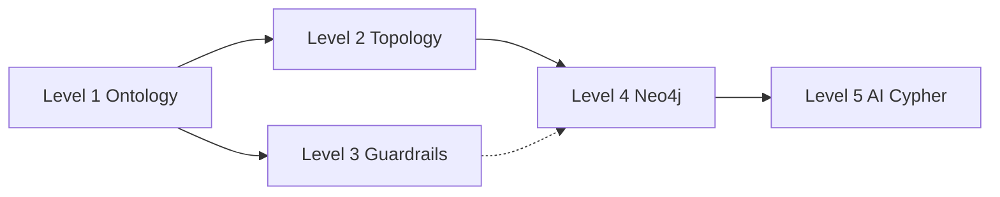

# Incremental Setup — Add Ontology & Graph to an Existing Project

Install **only what you need** from this boilerplate into a project you already have. No full repo clone required.

**Full bootstrap (greenfield):** [NEW-PROJECT-SETUP.md](./NEW-PROJECT-SETUP.md)  
**Daily prompts:** [VIBE-CODING.md](./VIBE-CODING.md)

---

## Choose your level

| Level | Name | Best for | Vibe code gain |
|-------|------|----------|----------------|
| **1** | Ontology SSOT | Any app — define domain once | High — Cursor stops inventing entities |
| **2** | Topology export | Same + lightweight graph file for `@` tags | High — Agent sees class ↔ class edges |
| **3** | Guardrails | Apps with business rules before writes | Medium — runtime enforcement |
| **4** | Neo4j graph | Relational / graph-shaped domain data | Medium — live queries, seed migrations |
| **5** | AI Cypher | NL queries over Neo4j | Low for vibe code — dev/query tool |

**Recommendation:** Start at **Level 1**, add **Level 2** (5 minutes). Add 3–5 only when you need them.



---

## Level 1 — Ontology only (minimum for vibe coding)

**Goal:** One JSON file is the domain contract. Cursor Agent edits features against it.

### Copy these files

```
ontology/schema.template.json   →  ontology/schema.json
```

Fill `classes`, `relationships`, `constraints` for your domain.

### Cursor rule

Create `.cursor/rules/ontology.mdc`:

```markdown
---
description: Domain SSOT
globs: ontology/**
---

- Business rules live in ontology/schema.json only.
- Do not invent new entity types or relationship names outside schema.json.
- Before adding features, read ontology/schema.json.
```

### How to use in Cursor

```
@ontology/schema.json

Add a Ticket entity linked to Customer. Update schema.json only.
```

### npm / TypeScript

**Not required** at this level.

### You get

- Shared vocabulary for humans and AI  
- No runtime, no database  
- Works in React, Python, Go, or any stack  

---

## Level 2 — Topology graph export

**Goal:** `graph-structure.json` for `@` tags — **relationship topology only**, no instance data.

**Requires:** Level 1 (`ontology/schema.json`)

### Copy these files

```
src/ontology/load.ts
src/ontology/types.ts
src/ontology/export-graph.ts
```

### Add to `package.json`

**devDependencies** (if not already present):

```json
"tsx": "^4.19.4",
"typescript": "^5.8.3",
"@types/node": "^22.15.21"
```

**scripts:**

```json
"graph:export": "tsx src/ontology/export-graph.ts"
```

### `tsconfig.json` (minimal, if you do not have one)

```json
{
  "compilerOptions": {
    "target": "ES2022",
    "module": "NodeNext",
    "moduleResolution": "NodeNext",
    "strict": true,
    "esModuleInterop": true,
    "skipLibCheck": true
  },
  "include": ["src/ontology/**/*.ts"]
}
```

Use `"type": "module"` in `package.json` if you use ESM (matches this boilerplate).

### Run

```bash
npm run graph:export
```

Creates `database/graph-structure.json` (add `database/` folder if missing). Add to `.gitignore` if you regenerate often:

```
database/graph-structure.json
```

### Cursor tags

```
@ontology/schema.json @database/graph-structure.json

Draw a mermaid diagram of allowed relationships. No instance data.
```

### You get

- Topology file Agent can read without Neo4j  
- Regenerate after every `schema.json` change  

---

## Level 3 — Guardrails runtime

**Goal:** Enforce `constraints` from `schema.json` before writes in your app.

**Requires:** Level 1 + Level 2 files (load + types)

### Copy these files

```
src/ontology/guardrails.ts
```

### Usage in your code

```typescript
import { loadOntology } from "./ontology/load.js";
import { validateAction } from "./ontology/guardrails.js";

const ontology = loadOntology();
const result = validateAction(ontology, "ASSIGN_TO_PROJECT", {
  employeeSkills: ["Java"],
  projectSkills: ["Java", "Neo4j"],
  projectDifficulty: "Hard"
});

if (!result.valid) {
  throw new Error(result.reason);
}
// proceed with your DB write
```

Adjust paths to match your project layout.

### New constraint types

Built-in: `rule.type: "skillOverlap"`. For other rules, add a handler in `guardrails.ts` but keep rule **meaning** in `schema.json`.

### Cursor rule (add one line)

```
- Do not duplicate constraints in application code; extend schema.json constraints.
```

### You get

- Runtime alignment with ontology  
- No Neo4j required  

---

## Level 4 — Neo4j graph layer

**Goal:** Store instance data in a graph; seed via migrations.

**Requires:** Level 1. Level 2 recommended.

### Copy these files

```
ontology/neo4j.mapping.json
database/docker-compose.yml
database/migrations/001_init.cypher    (replace with your domain seed)
src/neo4j/client.ts
```

### Add dependency

```json
"neo4j-driver": "^5.28.1"
```

### Add scripts

```json
"docker:up": "docker compose -f database/docker-compose.yml up -d",
"docker:down": "docker compose -f database/docker-compose.yml down"
```

### Add `.env` (or merge into existing)

```env
NEO4J_URI=bolt://localhost:7687
NEO4J_USER=neo4j
NEO4J_PASSWORD=strong_password_here
NEO4J_EXECUTE=false
```

### Steps

1. Align `neo4j.mapping.json` with `schema.json`  
2. Rewrite `001_init.cypher` using only declared labels and relationship types  
3. `npm run docker:up`  
4. Seed:

```bash
docker compose -f database/docker-compose.yml exec -T neo4j \
  cypher-shell -u neo4j -p strong_password_here \
  < database/migrations/001_init.cypher
```

### Cursor tags

```
@ontology/schema.json @ontology/neo4j.mapping.json @database/migrations/

Add seed data for a new Customer. Labels must match schema.json.
```

### Instance data vs topology

| File | Content |
|------|---------|
| `graph-structure.json` | Classes and predicates only (from `graph:export`) |
| Neo4j | Real rows — query in Browser or via Level 5 |

Do **not** put live Neo4j instance data into `graph-structure.json`.

### Integrate with your app

Import `createDriver` / `runReadQuery` from `src/neo4j/client.ts` where you need graph reads — do not copy `src/index.ts` unless you want the CLI demo.

### You get

- Graph DB aligned with ontology  
- Migrations as versioned seed/alter scripts  

---

## Level 5 — AI natural language → Cypher

**Goal:** Dev/ops tool — ask questions in English, get ontology-safe Cypher.

**Requires:** Level 1 + Level 4 (Neo4j for execution)

### Copy these files

```
src/agent/prompt_templates.ts
src/agent/generate_cypher.ts
src/index.ts                    (optional CLI demo only)
```

### Add dependency

```json
"openai": "^4.104.0"
```

### Add script (optional CLI)

```json
"dev": "tsx src/index.ts"
```

### `.env`

```env
OPENAI_API_KEY=sk-...
OPENAI_MODEL=gpt-4o-mini
NEO4J_EXECUTE=true
```

### Run

```bash
npm run dev "List all skills for employee EMP001"
```

### Use inside your project

Call `generateCypherQuery(ontology, userPrompt)` from your API or CLI — skip `index.ts` if you already have an entrypoint.

### You get

- NL queries constrained by ontology  
- Mock mode without API key  

---

## Quick reference — files per level

| Level | Files / folders |
|-------|-----------------|
| 1 | `ontology/schema.json`, `.cursor/rules/ontology.mdc` |
| 2 | + `src/ontology/load.ts`, `types.ts`, `export-graph.ts`, `graph:export` script |
| 3 | + `src/ontology/guardrails.ts` |
| 4 | + `ontology/neo4j.mapping.json`, `database/`, `src/neo4j/client.ts`, `neo4j-driver` |
| 5 | + `src/agent/*`, `openai`, optional `src/index.ts` |

---

## Mapping to an existing repo layout

| Your project | Place ontology kit here |
|--------------|-------------------------|
| Monorepo `apps/api/` | `apps/api/ontology/`, `apps/api/src/ontology/` |
| `backend/` | `backend/ontology/`, `backend/src/ontology/` |
| Root package | `ontology/`, `src/ontology/` (same as this repo) |

Update import paths and `loadOntology()` default path if `schema.json` is not at `ontology/schema.json`:

```typescript
loadOntology("/absolute/or/relative/path/to/schema.json");
```

---

## Suggested adoption path

### Week 1 — Vibe coding only

1. Level 1 — write `schema.json` for your real domain  
2. Level 2 — `graph:export` + tag both files in Cursor  
3. Add Cursor rule  

### When you need enforcement

4. Level 3 — call `validateAction` before critical writes  

### When you need graph data

5. Level 4 — Neo4j + migrations  
6. Level 5 — optional NL queries  

---

## Checklist per level

### Level 1

- [ ] `ontology/schema.json` exists and describes your domain  
- [ ] `.cursor/rules/ontology.mdc` created  
- [ ] Team agrees: domain changes go to `schema.json` first  

### Level 2

- [ ] `npm run graph:export` works  
- [ ] `graph-structure.json` has classes only, no instance IDs  
- [ ] Cursor prompts use `@database/graph-structure.json`  

### Level 3

- [ ] `validateAction` called before guarded operations  
- [ ] Constraints defined in JSON, not duplicated in handlers  

### Level 4

- [ ] `neo4j.mapping.json` matches schema  
- [ ] Migrations use only declared labels/rels  
- [ ] Seed runs; Browser shows graph  

### Level 5

- [ ] `generateCypherQuery` returns valid Cypher for your ontology  
- [ ] `NEO4J_EXECUTE=true` returns rows when expected  

---

## What NOT to copy

| Skip | Why |
|------|-----|
| Entire `package.json` | Merge deps/scripts into yours |
| Sample PM seed as-is | Replace with your domain |
| `ontology/template/*.jsonld` | Optional meta-vocab; not needed for core vibe coding |
| `src/index.ts` | Demo only — wire into your app instead |
| `docs/` | Read online or copy only guides you need |

---

## Summary

| Need | Install |
|------|---------|
| Better Cursor prompts, no infra | **Level 1** |
| Agent sees relationship map | **+ Level 2** |
| Enforce business rules in code | **+ Level 3** |
| Graph database for data | **+ Level 4** |
| Ask Neo4j in English | **+ Level 5** |

**Vibe coding sweet spot:** Level **1 + 2** — smallest install, largest reduction in AI drift.
